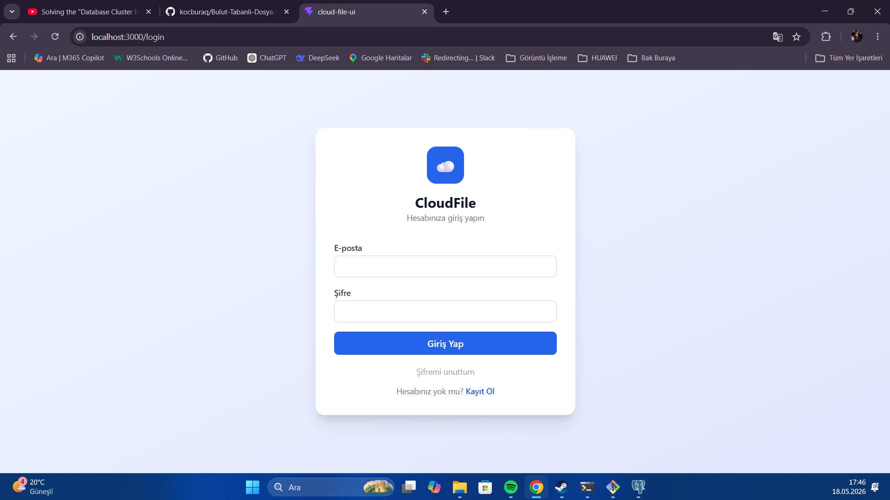
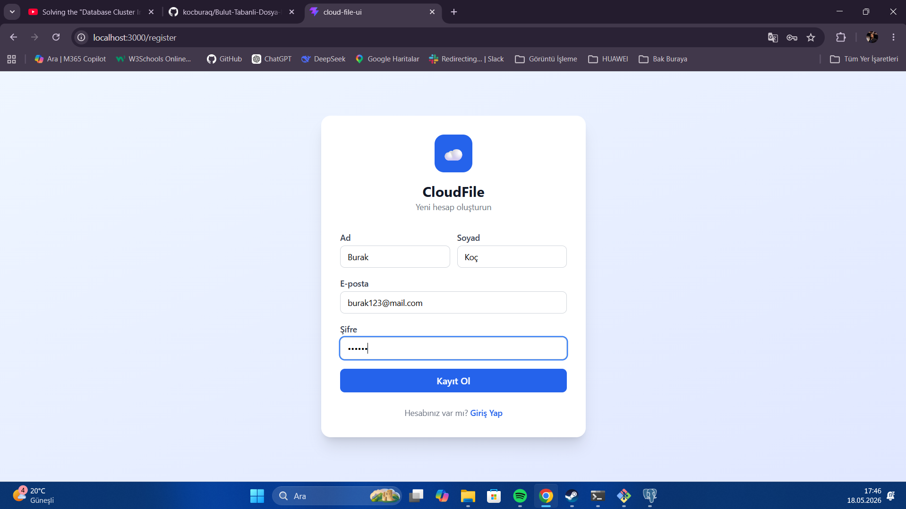
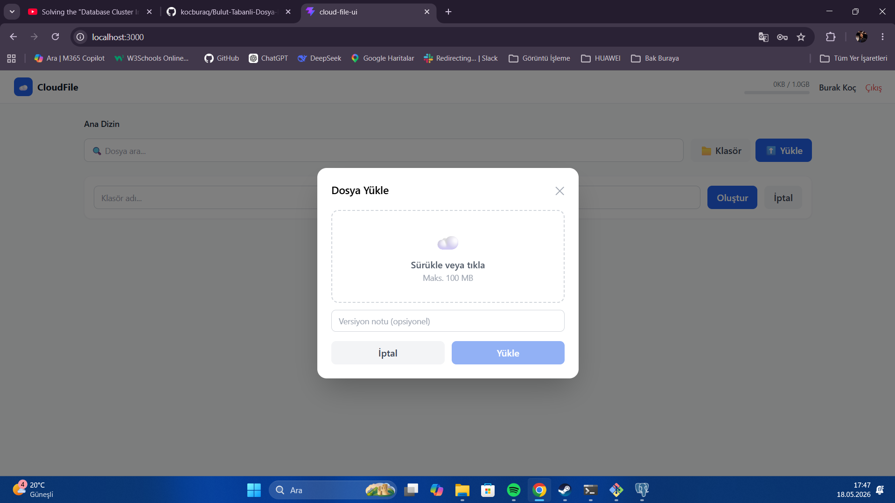
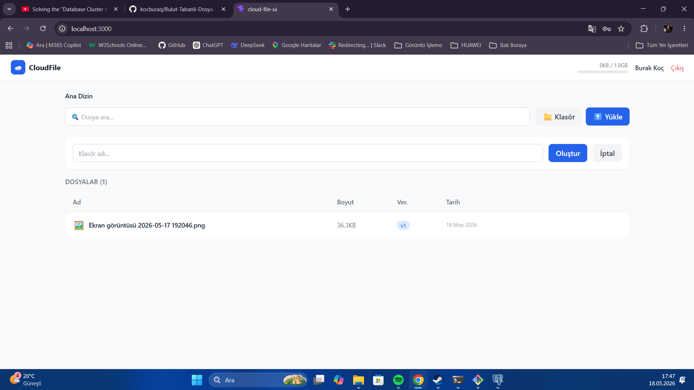
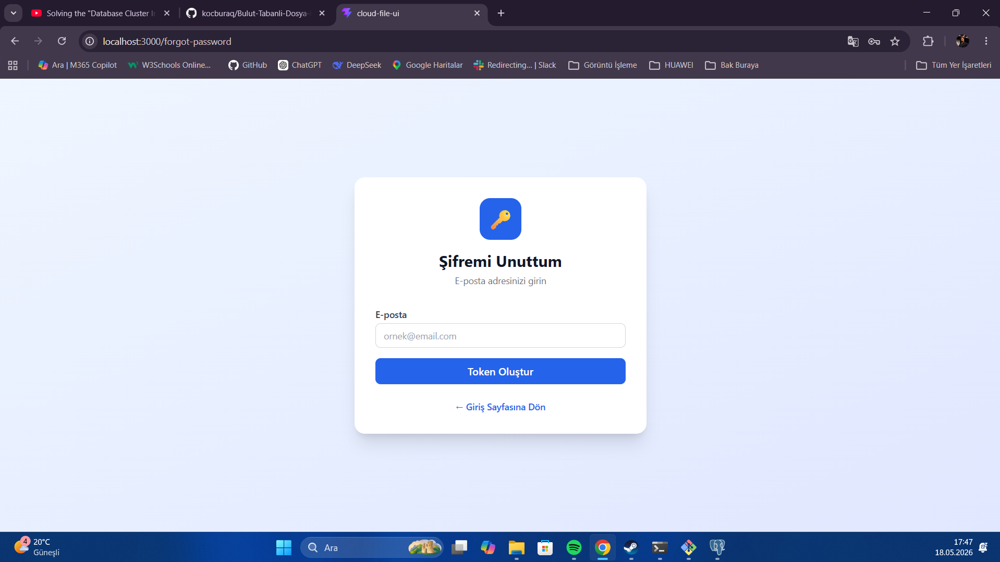

# Bulut Tabanlı Dosya Paylaşım ve İş Birliği Sistemi

**BMB306 - Yazılım Mühendisliği | Konu #18**  
**Öğrenci:** Burak Koç  
**Dönem:** 2025-2026 Bahar

---

## Proje Hakkında

Bu proje, kullanıcıların dosyalarını bulut ortamında depolayıp yönetebileceği, başkalarıyla paylaşabileceği ve birlikte çalışabileceği bir web uygulamasıdır. Ödev kapsamında full-stack olarak geliştirilmiştir.

## Özellikler

- Kullanıcı kayıt / giriş (JWT ile)
- Rol sistemi: Admin, Manager, User
- Klasör oluşturma ve yönetimi (iç içe klasörler)
- Dosya yükleme, indirme, silme (soft delete)
- Dosya versiyonlama — aynı dosyayı tekrar yüklersen yeni versiyon olarak kaydedilir, eski versiyona dönebilirsin
- Paylaşılabilir linkler (token bazlı, anonim erişim)
- Depolama kotası (varsayılan 1 GB, admin değiştirebilir)
- Admin paneli: kullanıcı yönetimi, rol/kota değiştirme, istatistikler
- Şifre sıfırlama (token bazlı)

## Kullanılan Teknolojiler

### Backend
- ASP.NET Core Web API (.NET 10)
- PostgreSQL + Entity Framework Core
- JWT Authentication
- BCrypt (şifre hashleme)
- Swagger UI

### Frontend
- React 18 + Vite
- Tailwind CSS
- React Router DOM
- Axios

## Kurulum

### Gereksinimler
- .NET 10 SDK
- PostgreSQL (port 5432)
- Node.js 18+

### Backend

```bash
cd backend/CloudFile.Api
```

`appsettings.json` içinde veritabanı bağlantısını ayarla:
```json
"ConnectionStrings": {
  "DefaultConnection": "Host=localhost;Port=5432;Database=cloud_file_db;Username=postgres;Password=SENIN_SIFREN"
}
```

```bash
dotnet ef database update
dotnet run
```

API: `http://localhost:5200`  
Swagger: `http://localhost:5200/swagger`

### Frontend

```bash
cd frontend/cloud-file-ui
npm install
npm run dev
```

Uygulama: `http://localhost:3000`

## Klasör Yapısı

```
bulut_tabanli_dosya_paylasma/
├── backend/
│   └── CloudFile.Api/
│       ├── Controllers/
│       ├── Models/
│       ├── Services/
│       ├── DTOs/
│       ├── Data/
│       └── Helpers/
├── frontend/
│   └── cloud-file-ui/
│       └── src/
│           ├── pages/
│           ├── components/
│           ├── context/
│           └── api/
├── screenshots/      ← ekran görüntüleri
└── uploads/          ← yüklenen dosyalar burada saklanır
```

## Notlar

- Şifre sıfırlama token'ı normalde e-posta ile gönderilmeli, şu an API response'da dönüyor (demo amaçlı)
- Yükleme limiti 100 MB olarak ayarlandı
- Dosyalar soft delete ile siliniyor, fiziksel dosya diskte kalıyor

## Ekran Görüntüleri

### Giriş Sayfası


### Kayıt Sayfası


### Dosya Yükleme


### Dosya İndirme


### Şifre Sıfırlama


---

*Burak Koç — Bilgisayar Mühendisliği*
